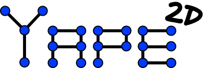

# Yape 2D

Yet Another Physics Engine (2D)

Yape 2D (Yet Another Physics Engine) is, as its name points out, a physics 
game engine in 2D. It is fully develped in C++ and it doesn't have any 
extra dependencies. 

Its goal is to provide a lightweight and simple api to simulate 2D physics 
for video games. It doesn't pretend to be super realistic, but instead it 
prioritise usability and performance. 

In theory, it could be compiled for any platform with a few tweaks, but as 
for now I have only tested in Windows and Web (via emscripten).

## How to use it
The project just has two folders: include and source. If you want to use 
Yape 2D in your project, you juse need to add then include folder to the 
include directories and add the files inside soruce to your project.

